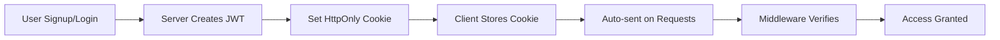

# 🛍️ Full-Stack E-Commerce Platform

> A modern, luxury e-commerce web application with glassmorphism UI design, built with React and Express.js

[](https://reactjs.org/)
[](https://expressjs.com/)
[](https://www.mongodb.com/)
[](https://tailwindcss.com/)
[](LICENSE)

---

## 🌟 What Makes This Special?

This isn't just another e-commerce template - it's a **full-stack production-ready application** featuring:

✨ **Luxury UI Design** - Glassmorphism effects with smooth gradients  
🔐 **Secure Authentication** - JWT tokens with HttpOnly cookies  
🛒 **Smart Shopping Cart** - Database-backed with auto-cleanup  
🌙 **Dark/Light Themes** - Smooth theme switching with persistence  
📱 **Fully Responsive** - Beautiful on any device  
🎨 **Modern Stack** - React 18, Express 5, MongoDB Atlas  
🚀 **Production Ready** - Security best practices included

---

## 💬 Support

Need help? Found a bug? Have suggestions?

- 📫 Open an [Issue](https://github.com/Ihsaan7/FullStack_Ecommerce-react-express-/issues)
- 💡 Start a [Discussion](https://github.com/Ihsaan7/FullStack_Ecommerce-react-express-/discussions)
- ⭐ Star this repo if you found it helpful!

---

## ✨ Key Features

### 🎨 Beautiful UI/UX

- 💎 Glassmorphism design with backdrop blur effects
- 🌈 Smooth gradient backgrounds in light theme
- 🌙 Dark/light theme toggle with localStorage persistence
- 🎭 Smooth animations and transitions
- 📱 Mobile-first responsive design

### 🔐 Authentication & Security

- 🔑 JWT-based authentication system
- 🍪 HttpOnly cookies (no localStorage for tokens!)
- 🔒 Password hashing with bcryptjs
- 🛡️ Protected routes and API endpoints
- ⏰ Auto-logout on token expiry

### 🛒 Shopping Cart

- 💾 Database-backed cart (not just localStorage!)
- 🔄 Real-time cart badge updates
- 🧹 Auto-cleanup of invalid products
- ✅ Toast notifications for all actions
- 📊 Cart persistence across sessions

### 🎯 Product Features

- 🏷️ Category-based filtering
- 🔍 Product search functionality
- 📝 Detailed product pages
- 🖼️ Image gallery with thumbnails
- 💰 Dynamic pricing and inventory

---

## 🛠️ Tech Stack

### 💻 Frontend

| Technology       | Version | Purpose                 |
| ---------------- | ------- | ----------------------- |
| **React**        | 18.3.1  | UI Framework            |
| **Vite**         | 7.1.7   | Build Tool & Dev Server |
| **React Router** | 7.9.3   | Client-side Routing     |
| **Tailwind CSS** | 4.1.14  | Styling Framework       |
| **Axios**        | 1.12.2  | HTTP Client             |
| **React Icons**  | 5.5.0   | Icon Library            |

### ⚙️ Backend

| Technology        | Version | Purpose              |
| ----------------- | ------- | -------------------- |
| **Express**       | 5.1.0   | Web Framework        |
| **MongoDB**       | Latest  | Database             |
| **Mongoose**      | 8.10.6  | ODM                  |
| **JWT**           | 9.0.2   | Authentication       |
| **bcryptjs**      | 2.4.3   | Password Hashing     |
| **cookie-parser** | 1.4.7   | Cookie Management    |
| **CORS**          | 2.8.5   | Cross-Origin Support |

---

## � Quick Start

### Prerequisites

Before you begin, make sure you have:

- 📦 Node.js (v18 or higher)
- 🗄️ MongoDB Atlas account (or local MongoDB)
- 🔧 npm or yarn package manager

### 📥 Installation

1️⃣ **Clone the repository**

```bash
git clone https://github.com/Ihsaan7/FullStack_Ecommerce-react-express-.git
cd FullStack_Ecommerce-react-express-
```

2️⃣ **Install Frontend Dependencies**

```bash
npm install
```

3️⃣ **Install Backend Dependencies**

```bash
cd backend
npm install
cd ..
```

4️⃣ **Set Up Environment Variables**

Create a `.env.development` file in the root directory:

```env
# Server Configuration
PORT=8000

# Database Configuration
MONGODB_URI=your_mongodb_connection_string_here

# JWT Configuration
JWT_SECRET=your_super_secret_jwt_key_here
JWT_SECRET_EXPIRY=7d

# Environment
NODE_ENV=development
```

> 💡 **Tip**: Use `.env.example` as a template!

5️⃣ **Seed the Database (Optional)**

```bash
cd backend
node seeds/seedProducts.js
cd ..
```

6️⃣ **Start Development Servers**

**Backend** (Terminal 1):

```bash
cd backend
npm start
# Server runs on http://localhost:8000
```

**Frontend** (Terminal 2):

```bash
npm run dev
# App runs on http://localhost:5173
```

7️⃣ **Open Your Browser**

```
🌐 http://localhost:5173
```

---

## 📂 Project Structure

```
📦 FullStack_Ecommerce
├── 📁 backend/              # Express.js backend
│   ├── 📁 db/              # Database connection
│   ├── 📁 middleware/      # Auth middleware
│   ├── 📁 models/          # Mongoose schemas
│   ├── 📁 routes/          # API endpoints
│   ├── 📁 seeds/           # Database seeders
│   └── 📄 index.js         # Server entry point
│
├── 📁 src/                 # React frontend
│   ├── 📁 api/            # API service layer
│   │   ├── base.js        # Axios config
│   │   ├── product.js     # Product APIs
│   │   └── category.js    # Category APIs
│   │
│   ├── 📁 component/      # Feature components
│   │   ├── cart/          # Cart components
│   │   └── home/          # Home components
│   │
│   ├── 📁 components/     # Shared components
│   │   ├── ErrorBoundary.jsx
│   │   ├── RequireAuth.jsx
│   │   └── Toast.jsx
│   │
│   ├── 📁 context/        # React Context
│   │   ├── ProductContext.js
│   │   ├── ProductProvider.jsx
│   │   └── ThemeContext.jsx
│   │
│   ├── 📁 contexts/       # Auth context
│   │   └── AuthContext.jsx
│   │
│   ├── 📁 layout/         # Layout components
│   │   ├── Container.jsx
│   │   └── NavLayout.jsx
│   │
│   ├── 📁 loader/         # Route data loaders
│   │   ├── recentLoader.js
│   │   └── storeLoader.js
│   │
│   ├── 📁 pages/          # Page components
│   │   ├── Home.jsx       # Landing page
│   │   ├── Store.jsx      # Product catalog
│   │   ├── Detail.jsx     # Product details
│   │   ├── Cart.jsx       # Shopping cart
│   │   ├── Login.jsx      # Login page
│   │   └── Signup.jsx     # Signup page
│   │
│   ├── 📄 router.jsx      # Route configuration
│   ├── 📄 main.jsx        # App entry point
│   └── 📄 index.css       # Global styles
│
├── 📁 public/             # Static assets
├── 📄 .env.example        # Environment template
├── 📄 .gitignore          # Git ignore rules
├── 📄 package.json        # Dependencies
├── 📄 tailwind.config.js  # Tailwind config
├── 📄 vite.config.js      # Vite config
└── 📄 README.md           # You are here! 👋
```

---

## 🔌 API Endpoints

### 🔐 Authentication

| Method | Endpoint       | Description           | Auth Required |
| ------ | -------------- | --------------------- | ------------- |
| `POST` | `/auth/signup` | Register new user     | Public 🌐     |
| `POST` | `/auth/login`  | Login user            | Public 🌐     |
| `GET`  | `/auth/me`     | Get current user info | Required 🔒   |
| `POST` | `/auth/logout` | Logout user           | Required 🔒   |

### 📦 Products

| Method | Endpoint        | Description          | Auth Required |
| ------ | --------------- | -------------------- | ------------- |
| `GET`  | `/products`     | Browse all products  | Public 🌐     |
| `GET`  | `/products/:id` | View product details | Public 🌐     |

> 💡 **Why are products public?** E-commerce sites allow browsing without login to encourage exploration and improve SEO!

### 🛒 Shopping Cart

| Method   | Endpoint           | Description           | Auth Required |
| -------- | ------------------ | --------------------- | ------------- |
| `GET`    | `/cart`            | Get user's cart       | Required 🔒   |
| `POST`   | `/cart/add`        | Add item to cart      | Required 🔒   |
| `PUT`    | `/cart/update`     | Update cart quantity  | Required 🔒   |
| `DELETE` | `/cart/remove/:id` | Remove item from cart | Required 🔒   |
| `DELETE` | `/cart/clear`      | Clear entire cart     | Required 🔒   |

**Legend:**

- 🌐 **Public** - No authentication needed (anyone can access)
- 🔒 **Required** - Must be logged in with valid JWT token

---

## 🎯 Features in Detail

### 🔐 Authentication Flow



**Security Features:**

- 🍪 HttpOnly cookies (JavaScript can't access them!)
- 🔒 7-day token expiry
- 🛡️ CORS protection
- 🔑 bcrypt password hashing (10 rounds)
- 🚫 No tokens in localStorage

### 🛒 Smart Cart System

**Features:**

- 💾 Stored in MongoDB (not just browser!)
- 🔄 Syncs across devices
- 🧹 Auto-removes invalid products
- ✅ Duplicate prevention
- 📊 Real-time badge updates
- 🎨 Toast notifications for feedback

**How it works:**

1. User clicks "Add to Cart"
2. Frontend sends POST request with JWT cookie
3. Backend validates user and product
4. Cart saved to user's MongoDB document
5. Toast notification confirms action
6. Cart badge updates instantly

### 🎨 Theme System

**Light Theme:**

- 🌈 Gradient backgrounds (gray-100, blue-100)
- 💎 Enhanced contrast for readability
- ✨ Glassmorphism effects

**Dark Theme:**

- 🌙 Deep blacks with subtle grays
- 🔵 Blue accents throughout
- 🎭 Smooth backdrop blur

**Persistence:**

- Saved in localStorage
- Automatically applied on page load
- Smooth transitions between themes

---

## 🔒 Security Best Practices

✅ **Environment Variables** - All secrets in `.env` files  
✅ **HttpOnly Cookies** - Tokens safe from XSS  
✅ **Password Hashing** - bcrypt with salt rounds  
✅ **CORS Configuration** - Controlled access  
✅ **Input Validation** - Backend validation  
✅ **Error Handling** - No sensitive data leaked  
✅ **Git Security** - `.env` files in `.gitignore`

---

## 🎨 Customization Guide

### 🌈 Change Theme Colors

Edit `tailwind.config.js`:

```js
module.exports = {
  theme: {
    extend: {
      colors: {
        primary: "#your-color",
        secondary: "#your-color",
      },
    },
  },
};
```

### 🔧 Modify API Base URL

Update `.env.development`:

```env
VITE_API_URL=https://your-api-url.com
```

### 🎭 Customize Gradients

In your components:

```jsx
className = "bg-gradient-to-br from-purple-100 via-pink-100 to-blue-100";
```

---

## 📱 Responsive Breakpoints

| Device     | Breakpoint | CSS Class |
| ---------- | ---------- | --------- |
| 📱 Mobile  | < 640px    | `sm:`     |
| 📱 Tablet  | < 768px    | `md:`     |
| 💻 Laptop  | < 1024px   | `lg:`     |
| 🖥️ Desktop | < 1280px   | `xl:`     |
| 🖥️ Large   | < 1536px   | `2xl:`    |

---

## 🚀 Deployment

### Frontend (Vercel)

```bash
npm run build
# Deploy dist folder to Vercel
```

### Backend (Railway/Render)

1. Set environment variables in platform
2. Connect GitHub repository
3. Auto-deploys on push

### Environment Variables for Production

```env
NODE_ENV=production
MONGODB_URI=your_production_db
JWT_SECRET=strong_production_secret
PORT=8000
```

---

## 🤝 Contributing

We love contributions! Here's how you can help:

1. 🍴 Fork the repository
2. 🌿 Create a feature branch
   ```bash
   git checkout -b feature/amazing-feature
   ```
3. 💾 Commit your changes
   ```bash
   git commit -m '✨ Add amazing feature'
   ```
4. 📤 Push to your branch
   ```bash
   git push origin feature/amazing-feature
   ```
5. 🎉 Open a Pull Request

### 📝 Commit Convention

Use emojis for better commit messages:

- ✨ `:sparkles:` - New feature
- 🐛 `:bug:` - Bug fix
- 📝 `:memo:` - Documentation
- 🎨 `:art:` - UI/Style changes
- ♻️ `:recycle:` - Refactoring
- 🔒 `:lock:` - Security fixes

---

## 🐛 Known Issues & Roadmap

### 🚧 Coming Soon

- [ ] 💳 Payment gateway integration (Stripe)
- [ ] 📧 Email notifications
- [ ] 📦 Order history page
- [ ] ⭐ Product reviews and ratings
- [ ] 🔍 Advanced search with filters
- [ ] 👤 User profile management
- [ ] 🎨 Admin dashboard
- [ ] 📊 Sales analytics

### 🐛 Known Issues

- None currently! 🎉

---

## 📖 Documentation

For detailed documentation, check out:

- 📘 [API Documentation](./docs/API.md)
- 📗 [Component Guide](./docs/COMPONENTS.md)
- 📙 [Deployment Guide](./docs/DEPLOYMENT.md)

---


## 📊 Stats


---

<div align="center">

### ⭐ If you found this project helpful, please give it a star! ⭐

**Built with ❤️ and ☕ by Ihsaan**

[⬆ Back to Top](#-full-stack-e-commerce-platform)

</div>
````

